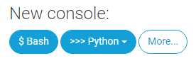
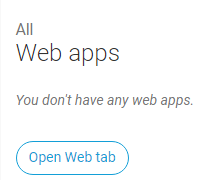
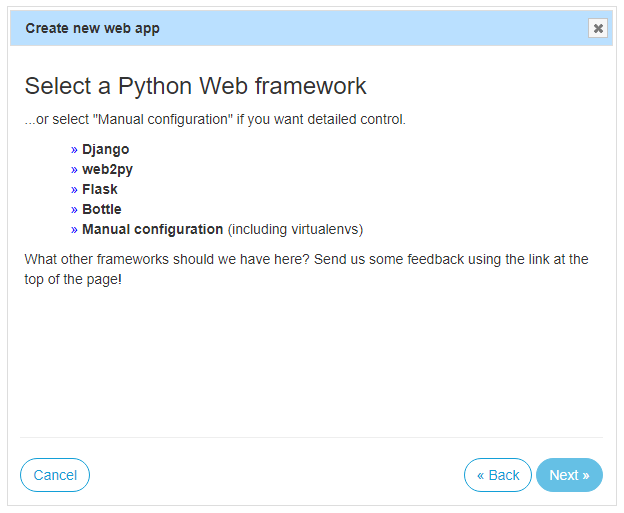
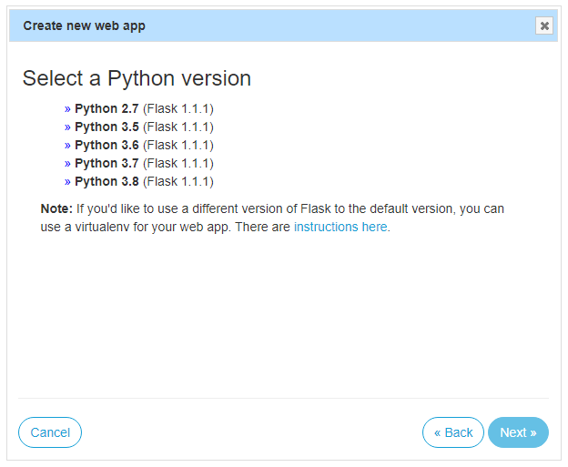
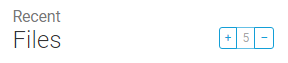
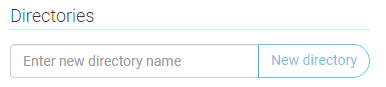
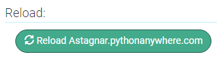

# VK-Admin-Bot

Бот администратор для беседы вк на Callback API.

* [Возможности бота](#Возможности-бота)
  * [Добавлено](#Добавлено)
  * [Скоро](#Скоро)
* [Настройка бота](#Настройка-бота)
* [Пример установки бота](#Пример-установки-бота)
* [Список команд](#Список-команд)

## Возможности бота

### Добавлено
- Исключение/бан участников.
- Предупреждение участников.
- РП команды.
- Исключение участника и удаление его сообщения если количество смайликов в сообщении превышает лимит.
- Исключение участника и удаление его сообщения если в сообщении обнаружено слово из банлиста.

### Скоро
- Вывод статистики.
- Логирование ошибок и их вывод по команде.

## Настройка бота

Заполняем поля файла **config.py**:
| Поле                   | Описание                                                                       |
|------------------------|--------------------------------------------------------------------------------|
| admins                 | Айди админов через запятую                                                     |
| bot_token              | Токен бота                                                                     |
| bot_id                 | Айди бота                                                                      |
| confirmation_token     | Секретный ключ бота                                                            |
| database               | Путь к базе данных                                                             |
| kick                   | Варианты вызова команды кик                                                    |
| ban                    | Варианты вызова команды бан                                                    |
| unban                  | Варианты вызова команды анбан                                                  |
| warn                   | Варианты вызова команды варн                                                   |
| unwarn                 | Варианты вызова команды анварн                                                 |
| settings               | Варианты вызова команды настройки                                              |
| emoji_limit            | Варианты вызова команды лимита эмодзи                                          |
| add_banword            | Варианты вызова команды добавления слова в банлист                             |
| del_banword            | Варианты вызова команды удаления слова из банлиста                             |

Для получения токена группы переходим в нужную группу:
```
-> Управление
-> Настройки
-> Работа с API
-> Создать ключ
-> Выставляем галочки и создаем
```

Для получения айди группы переходим в нужную группу:
```
-> Управление
-> Настройки
-> Адрес сообщества
-> Номер сообщества
-> club*цифры*
-> Копируем только цифры
```

Разрешаем добавлять бота в беседы:
```
-> Управление
-> Сообщения
-> Сообщения сообщества: Включены
-> Настройки для бота
-> Возможности ботов: Включены
-> Разрешать добавлять сообщество в беседы - ставим галочку
```

Настройка Callback API:
```
-> Настройки
-> Работа с API
-> Callback API
-> Версия API: 5.130
-> Типы событий
-> Выставляем галочки
```

## Пример установки бота
В качестве бесплатного хостинга берем [pythonanywhere](https://www.pythonanywhere.com).

После регистрации нажимаем кнопку **Bash** и вводим в консоли команду ```pip3.7 install --user vk_api```
<p align="left">
  <a href="">
    
  </a>
</p>

Далее возвращаемся на начальный экран (просто кликнув по логотипу сайта) и переходим в раздел **Web apps**.
<p align="left">
  <a href="">
    
  </a>
</p>

Нажимаем кнопку **Add a new web app**.
<p align="left">
  <a href="">
    
  </a>
</p>

Далее выбираем **Flask**, затем **Python 3.7** и кнопку жмем кноку **Next**. Указываем имя **bot_app.py**.
<p align="left">
  <a href="">
    
  </a>
  <a href="">
    
  </a>
</p>

Возвращаемся на начальный экран и переходим в раздел **Files**.
<p align="left">
  <a href="">
    
  </a>
</p>

В левом меню выбираем **mysite/** и удаляем файл **bot_app.py**.
<p align="left">
  <a href="">
    
  </a>
</p>

Загружаем сюда файлы **bot_app.py** и **config.py**.

В левом меню вводим название **commands**, нажимаем **New directory** и загружаем в нее файлы из папки **commands**.
<p align="left">
  <a href="">
    
  </a>
</p>

Возвращаемся в папку **mysite/** и делаем так же с остальными папками.

Переходим в группу бота.
```
-> Настройки
-> Работа с API
-> Callback API 
```
Копируем значение из поля **"Строка, которую должен вернуть сервер"**, вставляем в файл **config.py** в поле **confirmation_token** и сохраняем.

В группе в том же меню в поле **"Адрес"** вставляем ссылку на свой сайт.

Чтобы получить ее возвращаемся в раздел **Web apps**, нажимаем на ссылку в строке **Configuration for <ссылка>** и копируем ссылку из адресной строки.

После этого в разделе **Web apps** нажимаем кнопку **Reload <ваш сайт>**.
<p align="left">
  <a href="">
    
  </a>
</p>

**Один раз в три месяца нужно будет заходить на сайт и "продлевать жизнь" бота.**

**Если боту долго не будут приходить новые события, то он "уснёт", но если ему отправить какую-то команду, то спустя некоторое время молчания он ответит и продолжит работу с обычной скоростью.**

## Список команд

### Префиксы

  * `url` - ссылка на страницу участника.
  * `ping` - упоминание участника.

  * `reply` - ответ на сообщение участника.

  * `int` - целое число.

  * `text` - произвольный текст.

  * `rp` - РП команда (список доступен по пути utils/rp_commands.py).

При вызове команд не нужно писать <>.

`кик <url / ping / reply>` - исключает участника из беседы.

`бан <url / ping / reply>` - добавляет участинка в банлист.

`анбан <url / ping / reply>` - удаляет участинка из банлиста.

`варн <url / ping / reply>` - выдает участинку предупреждение.

`анварн <url / ping / reply>` - снимает с участника все предупреждения.

`повысить <url / ping / reply>` - выдает участинку роль администратора.

`понизить <url / ping / reply>` - снимает с участинка роль администратора.

`настройки эмодзи <int>` - изменяет максимально допустимое количество эмодзи в 1 сообщении.

`настройки +банворд <text>` - добавляет слово / слова в банлист.

`настройки -банворд <text>` - удаляет слово / слова из банлиста.

`<rp> <url / ping / reply>` - вызывает РП команду.
